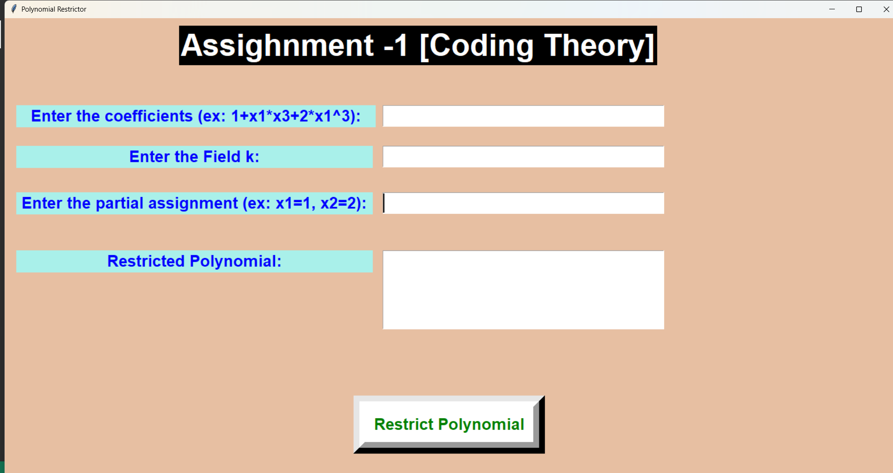

# Polynomial Restrictor

A **Polynomial Restrictor** application with a GUI built using **Python (Tkinter)**. It allows users to restrict polynomials over a given field and apply partial assignments.

## 🚀 Features

- **Polynomial Parsing** – Parses input polynomials into structured terms
- **Field Restriction** – Modulo operation to restrict polynomials over a given field
- **Partial Assignment** – Assigns values to specific variables to simplify expressions
- **Graphical User Interface (GUI)** – Built with Tkinter for easy user interaction
- **Real-time Calculation** – Instantly updates results on polynomial modification

## 🛠 Technologies Used

- **Python** – Core logic and computations
- **Tkinter** – GUI implementation

## 📂 Installation

1. Clone the repository:
   ```sh
   git clone https://github.com/thaksen-karote/polynomial-restrictor.git
   ```
2. Navigate to the project directory:
   ```sh
   cd polynomial-restrictor
   ```
3. Run the application:
   ```sh
   python run_file.py
   ```

## 📷 Screenshot
 


## 📌 How to Contribute

Want to improve this project? Fork the repository, make your changes, and create a pull request!

---

Made with by [Thaksen Karote](https://github.com/thaksen-karote/)
